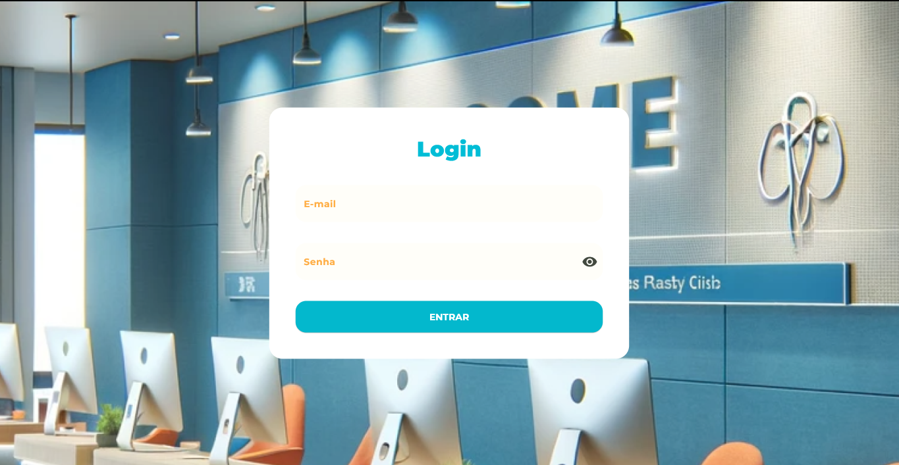

# fe_lab_clinicas_adm

Um projeto feito na Flutter Expirience

## Inicio

Este app foi criado durante o evento da Flutter Expirience, evento de flutter. Esse app é uma das três versões desenvolvida no Flutter Expirience. Onde tinha como objetivo criando a central de admnistradores do projeto clinicas.

## O que foi usado
No projeto foi usado a arquitetura mvvm (Model view model), os pacotes flutter_getit para gerencia de depências, e o signals para gerência de estado. Logo abaixo vai ter uma lista com todos os pacotes usado neste projeto.

<ul>
  <li>flutter_getit: ^2.0.0</li>
  <li>dio: ^5.4.0</li>
  <li>shared_preferences: ^2.2.2</li>
  <li>asyncstate: ^2.1.1-dev.1</li>
  <li>signals_flutter: ^3.0.0</li>
  <li>validatorless: ^1.2.3</li>
  <li>json_annotation: ^4.8.1</li>
  <li><a href='https://github.com/emanuelxenos/lab_clinicas_core'>Lab Clinicas Core</a></li>
</ul>
Dev_depencies:
<ul>
  <li>flutter_lints: ^2.0.0</li>
  <li>json_serializable: ^6.7.1</li>
  <li>build_runner: ^2.4.8</li>
</ul>

## Capturas de tela  do projeto

